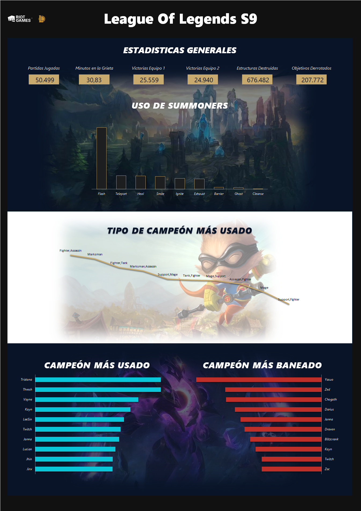

# Proyecto Final - Curso 1 - Máster Data Analytics

Proyecto final del primer año del Máster de Data Analytics. En este proyecto se realiza un **EDA** (Exploratory Data Analysis) y un **Dashboard** a partir de un conjunto de datos del videojuego *League of Legends*.

## Gestión

La limpieza y análisis de los datos se realizan principalmente en **Excel**, lo que permite un flujo más unificado y sencillo.  

La carga y limpieza inicial se llevan a cabo con **PowerQuery**, y el análisis con **tablas dinámicas**. Posteriormente, se extraen **KPIs principales utilizando Python**, aprovechando la funcionalidad recientemente incorporada en *Excel*. Esto facilita mantener todo el análisis dentro de la misma herramienta.

## Archivos

El conjunto consta de 4 archivos principales:

- `games.csv` - Contiene el grueso de los datos a analizar, correspondientes a partidas de la temporada 9. Incluye información como duración de la partida, campeones jugados, etc.
- `champion_info.json` - Información de los campeones, con su nombre y la clave para enlazar con `champion_info_2.json`.
- `champion_info_2.json` - Información adicional de los campeones: tipo, título y nombre.
- `summoner_spell_info.json` - Información de los hechizos de invocador (nombre y descripción).

Información de las columnas de <code>games.csv</code>

Incluye identificadores de partida, equipos, duración, estructuras destruidas, objetivos conseguidos, campeones seleccionados, bans y summoners.  

Ejemplos:  
- **gameId:** identificador de la partida.
- **creationTime:** fecha en la que se jugó la partida.
- **gameDuration:** duración de la partida en segundos.
- **seasonId:** identificador de la temporada.
- **winner:** equipo ganador.
- **firstBlood:** equipo que realiza la primera sangre.
- **firstTower:** equipo que destruye la primera torre.
- **firstInhibitor:** equipo que destruye el primer inhibidor.
- **firstBaron:** equipo que derrota al primer *Baron*.
- **firstDragon:** equipo que derrota al primer *Dragon*.
- **firstRiftHerald:** equipo que derrota al primer *Heraldo*.
- **t1_champ1id:** id del primer campeón elegidor por el *Equipo 1*.
- **t1_champ1_sum1:** id del primer summoner utilizado por el primer campeón del *Equipo 1*.
- **t1_champ1_sum2:** id del segundo summoner utilizado por el primer campeón del *Equipo 1*.
- **t1_champ2id:** id del segundo campeón elegidor por el *Equipo 1*.
- **t1_champ2_sum1:** id del primer summoner utilizado por el segundo campeón del *Equipo 1*.
- **t1_champ2_sum2:** id del segundo summoner utilizado por el segundo campeón del *Equipo 1*.
- **t1_champ3id:** id del tercero campeón elegidor por el *Equipo 1*.
- **t1_champ3_sum1:** id del primer summoner utilizado por el tercero campeón del *Equipo 1*.
- **t1_champ3_sum2:** id del segundo summoner utilizado por el tercero campeón del *Equipo 1*.
- **t1_champ4id:** id del cuarto campeón elegidor por el *Equipo 1*.
- **t1_champ4_sum1:** id del primer summoner utilizado por el cuarto campeón del *Equipo 1*.
- **t1_champ4_sum2:** id del segundo summoner utilizado por el cuarto campeón del *Equipo 1*.
- **t1_champ5id:** id del quinto campeón elegidor por el *Equipo 1*.
- **t1_champ5_sum1:** id del primer summoner utilizado por el quinto campeón del *Equipo 1*.
- **t1_champ5_sum2:** id del segundo summoner utilizado por el quinto campeón del *Equipo 1*.
- **t1_towerKills:** torres destuidas por el *Equipo 1*.
- **t1_inhibitorKills:** inhibidores destuidas por el *Equipo 1*.
- **t1_baronKills:** *Barones* derrotados por el *Equipo 1*.
- **t1_dragonKills:** *Dragones* derrotados por el *Equipo 1*.
- **t1_riftHeraldKills:** *Heraldos* derrotados por el *Equipo 1*.
- **t1_ban1:** id del campeón baneado por el primer jugador del *Equipo 1*.
- **t1_ban2:** id del campeón baneado por el segundo jugador del *Equipo 1*.
- **t1_ban3:** id del campeón baneado por el tercero jugador del *Equipo 1*.
- **t1_ban4:** id del campeón baneado por el cuarto jugador del *Equipo 1*.
- **t1_ban5:** id del campeón baneado por el quinto jugador del *Equipo 1*.
- **t2_champ1id:** id del primer campeón elegidor por el *Equipo 2*.
- **t2_champ1_sum1:** id del primer summoner utilizado por el primer campeón del *Equipo 2*.
- **t2_champ1_sum2:** id del segundo summoner utilizado por el primer campeón del *Equipo 2*.
- **t2_champ2id:** id del segundo campeón elegidor por el *Equipo 2*.
- **t2_champ2_sum1:** id del primer summoner utilizado por el segundo campeón del *Equipo 2*.
- **t2_champ2_sum2:** id del segundo summoner utilizado por el segundo campeón del *Equipo 2*.
- **t2_champ3id:** id del tercero campeón elegidor por el *Equipo 2*.
- **t2_champ3_sum1:** id del primer summoner utilizado por el tercero campeón del *Equipo 2*.
- **t2_champ3_sum2:** id del segundo summoner utilizado por el tercero campeón del *Equipo 2*.
- **t2_champ4id:** id del cuarto campeón elegidor por el *Equipo 2*.
- **t2_champ4_sum1:** id del primer summoner utilizado por el cuarto campeón del *Equipo 2*.
- **t2_champ4_sum2:** id del segundo summoner utilizado por el cuarto campeón del *Equipo 2*.
- **t2_champ5id:** id del quinto campeón elegidor por el *Equipo 2*.
- **t2_champ5_sum1:** id del primer summoner utilizado por el quinto campeón del *Equipo 2*.
- **t2_champ5_sum2:** id del segundo summoner utilizado por el quinto campeón del *Equipo 2*.
- **t2_towerKills:** torres destuidas por el *Equipo 2*.
- **t2_inhibitorKills:** inhibidores destuidas por el *Equipo 2*.
- **t2_baronKills:** *Barones* derrotados por el *Equipo 2*.
- **t2_dragonKills:** *Dragones* derrotados por el *Equipo 2*. 

Estructura del archivo <code>champion_info.json</code>

Consta de un conjunto de objetos con clave numérica para identificar a cada campeón. Cada campeón tiene esta información:

- **title:** título del campeón.  
- **id:** identificador del campeón.  
- **key:** clave del campeón (para enlazar con `champion_info_2.json`).  
- **name:** nombre del campeón.  

Estructura del archivo <code>champion_info_2.json</code>

Consta de un conjunto de objetos con clave el nombre del campeón. Cada campeón tiene esta información:

- **tags:** categorías del campeón.  
- **title:** título del campeón.  
- **id:** identificador del campeón (relacionado con `champion_info.json`).  
- **key:** clave del campeón.  
- **name:** nombre del campeón.  

Estructura del archivo <code>summoner_spell_info.json</code>

Consta de un conjunto de objetos con clave numérica para identificar cada summoner. Cada summoner tiene esta información:

- **id:** identificador del summoner.  
- **summonerLevel:** nivel del summoner.  
- **name:** nombre del summoner.  
- **key:** clave del summoner.  
- **description:** descripción del summoner.  

## Limpieza de los datos

Acciones realizadas sobre `games.csv` en **PowerQuery**:

- Conversión de tipos (números en columnas de kills/objetivos y texto en el resto).  
- Eliminación de duplicados.  
- Eliminación de columnas irrelevantes (*creationTime*, *seasonId*).  
- Sustitución de identificadores de equipos por valores descriptivos (*Equipo 1*, *Equipo 2*, *Ninguno*).  
- Cruce con archivos JSON para sustituir IDs de campeones, bans y summoners por sus nombres.  
- Renombrado y reordenación de columnas.  
- Filtrado de partidas inválidas (ej. sin *Primera Sangre*).  

Sobre los demás archivos JSON (`champion_info_2.json` y `summoner_spell_info.json`), se reordenaron columnas y se dejaron únicamente las relevantes para el análisis.

Con estos datos tenemos suficiente para poder empezar nuestro análisis.

## Análisis

El análisis se centra en extraer **estadísticas generales** y visualizar tendencias.  

Métricas principales:  

- Partidas jugadas.  
- Promedio de duración de la partida.  
- Victorias del equipo 1.  
- Victorias del equipo 2.  
- Estructuras destruidas.  
- Objetivos derrotados.  

Visualizaciones:  

- Summoner más utilizado.  
- Tipo de campeón más jugado.  
- Campeón más utilizado.  
- Campeón más baneado.  

Para esto se usaron **consultas en PowerQuery** (incluyendo transposición y agrupación) y **Python con Pandas** para cálculos y generación de KPIs.

## Conclusión final

Todo este análisis y Dashboard nos permite:  

- Medir la constancia en el número de partidas jugadas.  
- Evaluar la duración promedio para detectar si las partidas son demasiado cortas o largas.  
- Verificar el equilibrio en las victorias de ambos equipos (balance competitivo).  
- Revisar las categorías de campeones para sugerir ajustes de balance.  
- Analizar los campeones más utilizados y más baneados, lo que ayuda a diagnosticar cuáles pueden estar desbalanceados y promover el uso de campeones menos frecuentes.  

## Resultado

